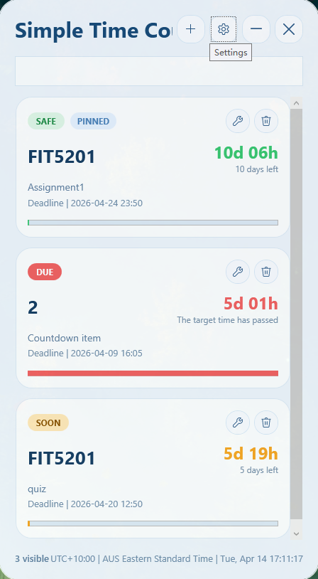

# Simple Time Countdown

<div align="center">

[**English**](README.md) | [简体中文](README.zh-CN.md)

</div>


A lightweight floating countdown app for Windows 11, built with WPF and .NET 8.



## Why this project

Simple Time Countdown is designed around three product goals:

- Lightweight: desktop-native WPF app, no browser runtime, no Electron-style memory overhead
- Low resource usage: local JSON storage, no background sync service, and a small always-available footprint
- Clean UI: floating glass-style panel, focused countdown cards, and a simple desktop-first interaction model

## Repository structure

- `.github/workflows/` contains CI for Windows builds
- `docs/` contains repository, release, and development workflow documentation
- `packaging/msix/` contains the MSIX manifest and packaging assets
- `scripts/` contains asset generation, publish, and install scripts
- `src/SimpleTimeCountdown.App/` contains the WPF desktop app
- `src/SimpleTimeCountdown.Setup/` contains the branded installer
- `artifacts/` is generated output only and should not be committed

## Development workflow

This project follows a reusable lightweight desktop app workflow, from product definition and UI preview through packaging and GitHub publication. See [docs/DEVELOPMENT_WORKFLOW.md](/E:/Work/Github%20Repository/Time%20Countdown/docs/DEVELOPMENT_WORKFLOW.md).

## Features

- Floating desktop panel inspired by Sticky Notes
- Lightweight desktop-native architecture focused on low overhead
- Clean, minimal UI that stays readable as a desktop utility
- Multiple countdown cards with pinned, urgent, and overdue states
- English and Simplified Chinese UI language switching
- Search and filter for all, urgent, pinned, and overdue items
- Experimental desktop-layer mode that can attach the panel to the Windows desktop host
- Dedicated settings window for display, startup, defaults, and panel placement
- Drag the floating panel from any non-interactive area, not only the header
- Local JSON persistence under `%AppData%\TimeCountdown\state.json`
- Tray icon with quick show, add, settings, always-on-top toggle, and exit
- Registry-based launch at startup
- Reminder balloons and due notifications
- App icon assets plus portable and MSIX packaging scripts

## Build

1. Install the .NET 8 SDK with WPF desktop support.
2. Open [SimpleTimeCountdown.sln](/E:/Work/Github%20Repository/Time%20Countdown/SimpleTimeCountdown.sln) in Visual Studio 2022 or build from a Developer PowerShell.
3. Run:

```powershell
dotnet build E:\Work\Github Repository\Time Countdown\SimpleTimeCountdown.sln
```

## Publish

Portable zip:

```powershell
powershell -ExecutionPolicy Bypass -File E:\Work\Github Repository\Time Countdown\scripts\Publish-Portable.ps1
```

MSIX package:

```powershell
powershell -ExecutionPolicy Bypass -File E:\Work\Github Repository\Time Countdown\scripts\Publish-MSIX.ps1
```

Install the generated MSIX locally:

```powershell
powershell -ExecutionPolicy Bypass -File E:\Work\Github Repository\Time Countdown\scripts\Install-MSIX.ps1
```

For the first install of the self-signed development package, Windows may require running the install step from an elevated PowerShell so the certificate can be trusted at the machine level.

Classic `Setup.exe` installer:

```powershell
powershell -ExecutionPolicy Bypass -File E:\Work\Github Repository\Time Countdown\scripts\Build-SetupExe.ps1
```

Outputs:

- Portable zip: [SimpleTimeCountdown-Release-win-x64-portable.zip](/E:/Work/Github%20Repository/Time%20Countdown/artifacts/packages/SimpleTimeCountdown-Release-win-x64-portable.zip)
- Setup EXE: [SimpleTimeCountdown-Setup-win-x64.exe](/E:/Work/Github%20Repository/Time%20Countdown/artifacts/packages/SimpleTimeCountdown-Setup-win-x64.exe)
- MSIX: [SimpleTimeCountdown_1.2.0.0_win-x64.msix](/E:/Work/Github%20Repository/Time%20Countdown/artifacts/packages/SimpleTimeCountdown_1.2.0.0_win-x64.msix)
- Dev certificate: [TimeCountdownDev.cer](/E:/Work/Github%20Repository/Time%20Countdown/artifacts/certificates/TimeCountdownDev.cer)

## Download

Get the latest version from this repository's GitHub Releases page:

- Latest release: [Releases / Latest](../../releases/latest)
- All versions: [Releases](../../releases)

Package differences:

- `SimpleTimeCountdown-Setup-win-x64.exe` (Recommended for most users)
  - Standard installer experience
  - Creates Start menu/desktop entries and uninstall entry
  - Best for one-click install and normal daily use
- `SimpleTimeCountdown-Release-win-x64-portable.zip`
  - No installer; unzip and run directly
  - No system-level install/uninstall registration
  - Best for USB drive, temporary use, or restricted environments
- `SimpleTimeCountdown_*.msix`
  - MSIX package model with cleaner install/uninstall isolation
  - Better managed by Windows package infrastructure
  - Best for users who prefer MSIX deployment workflows
